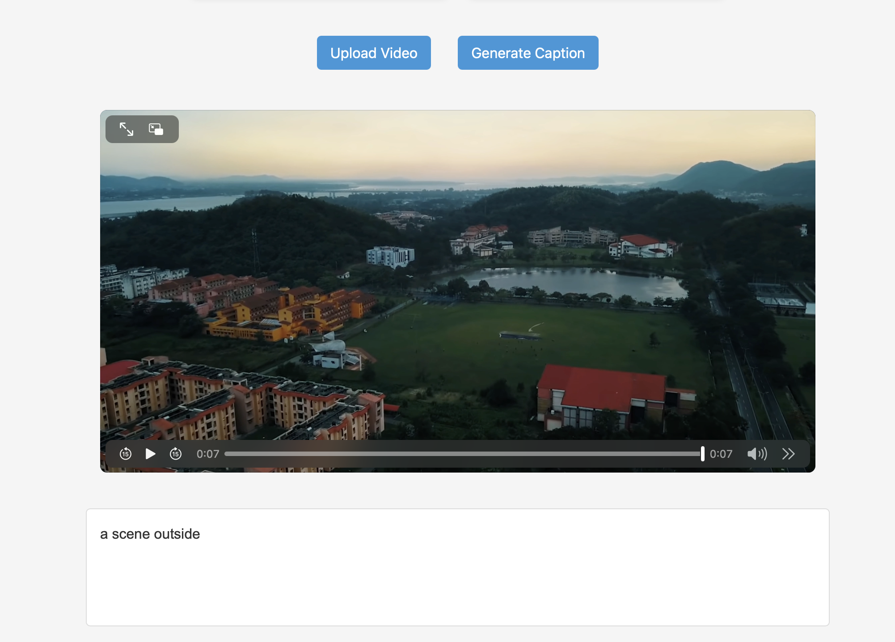
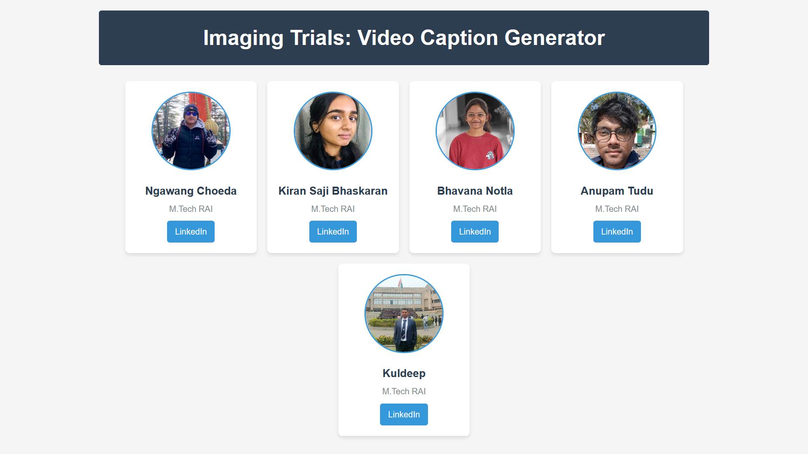

# 🎥 Attention-based Video Captioning using S2VT

This project implements an **Attention-augmented Sequence-to-Sequence Video-to-Text (S2VT)** model for generating natural language captions from video input.

> 📘 Course: DA526 - Image Processing with Machine Learning  
> 👨‍🏫 Instructor: Prof. Debanga Raj Neog  
> 🏫 Indian Institute of Technology Guwahati

---

## 📌 Abstract

This project addresses the task of **automated video captioning**, where a system generates descriptive captions from videos by understanding spatial and temporal patterns. It uses:

- CNN: `ResNet-152` for frame-level feature extraction
- LSTM-based Encoder-Decoder architecture
- Soft Attention mechanism to align visual features with generated words
- Evaluation on the **MSVD dataset** using **BLEU score**

---

## 🎯 Demo

### 🔗 Click to Watch

[](https://youtu.be/BR8bEPEYJBM)

## 🧠 Model Architecture

- 🧩 Encoder: CNN feature extractor (ResNet152)
- ⏱️ LSTM Encoder → Attention Layer → LSTM Decoder
- 🔤 Tokenized captions with `<PAD>`, `<SOS>`, `<EOS>`, `<UNK>`
- 🔎 Beam search for inference

---

## 😊 Check out the Repository to know more about it

```bash
git clone https://github.com/anupamtudu/Imaging-Trials.git
cd Imaging-Trials
```

---



Made with ❤️ by the Imaging Trials Team
